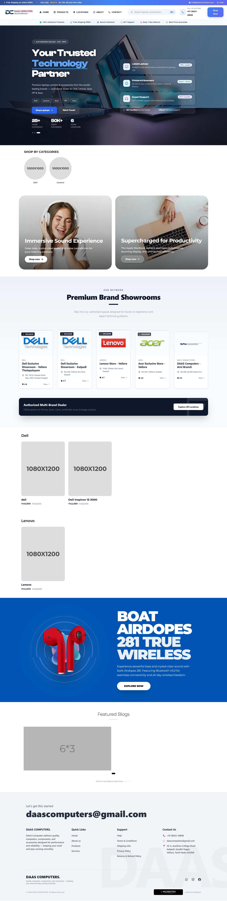
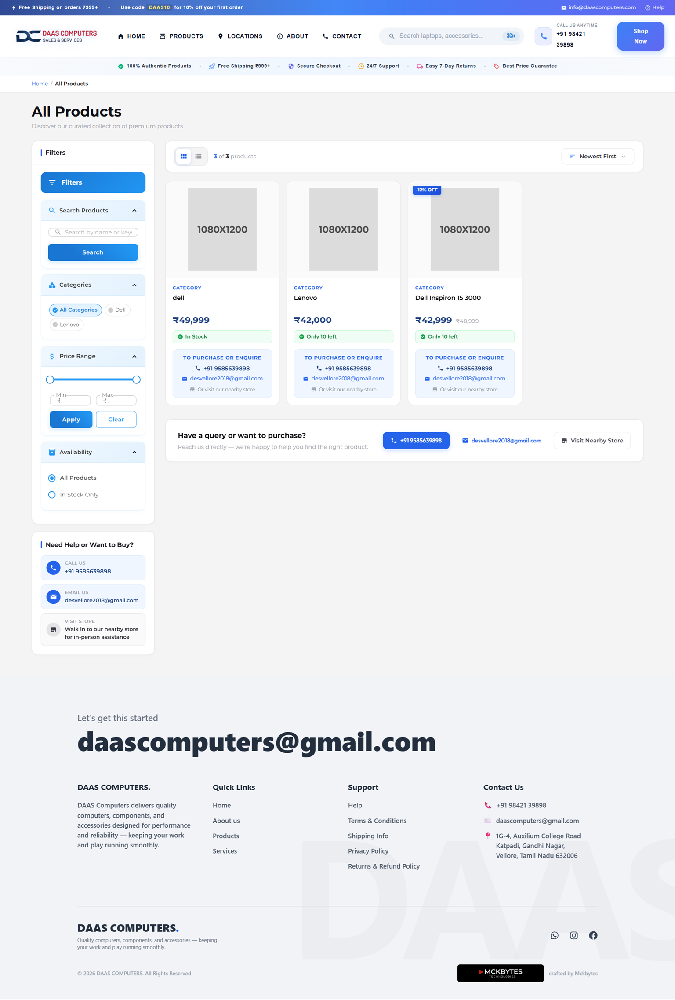
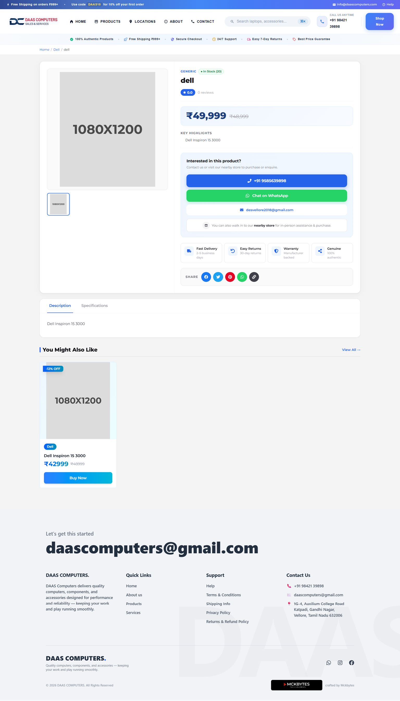

# MERN E-Commerce Minimal

Live Demo: https://dass.mckbytes.in/

---

## Project Overview

This project is a minimal dynamic eCommerce web application built using the MERN stack (MongoDB, Express.js, React.js, Node.js). It focuses on implementing the core structure and workflow of an online shopping platform with a clean and scalable architecture.

The application demonstrates essential full-stack development concepts including frontend rendering, backend API integration, and database management.

---

## Features

* Product listing page
* Product detail view
* Dynamic data rendering
* Basic shopping workflow
* RESTful API integration
* Responsive user interface

---

## Tech Stack

### Frontend

* React.js
* HTML5
* CSS3
* JavaScript

### Backend

* Node.js
* Express.js

### Database

* MongoDB

### Tools

* Git and GitHub
* Postman
* Visual Studio Code

---

## Project Screenshots

### Home Page

### Product Listing

### Product Detail Page

---

## Project Structure

satic-ecommerce/
│── frontend/        React application
│── backend/         Node.js and Express API
│── img/             Project screenshots
│── README.md

---

## Installation and Setup

### Clone the repository

git clone https://github.com/Bharath8992/mern-ecommerce.git

### Navigate to project folder

cd mern-ecommerce-minimal

---

### Backend Setup

cd backend
npm install

Create a `.env` file and configure:
MONGO_URI=your_mongodb_connection_string
PORT=5000

Run the backend:
npm start

---

### Frontend Setup

cd frontend
npm install

Run the frontend:
npm start

---

### Access the Application

http://localhost:3000/

---

## Future Enhancements

* Add authentication system
* Implement cart functionality
* Integrate payment gateway
* Build admin dashboard

---

## Security Note

For security reasons, server configuration files and sensitive environment variables are not included in this repository. If access is required for review or collaboration, please contact:

[bharath122020@gmail.com](mailto:bharath122020@gmail.com)

---

## Author

Bharath A
Full Stack Developer
Vellore, India

---

## Support

If you find this project useful, consider starring the repository and sharing your feedback.
